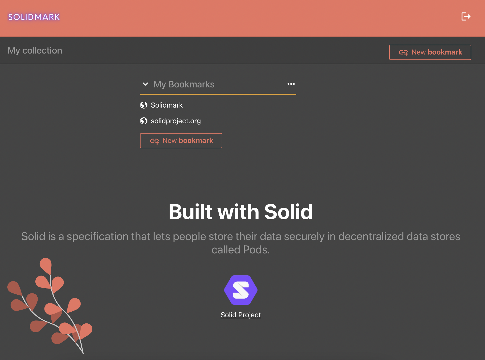

#communication

## What is Solidmark?
Solidmark is a fork of the [booky.io](#what-is-bookyio) front end, with the [Solid Protocol](#what-is-solid) implemented in place of the backend database.
The primary objective of this project is to show how one might implement Solid into an existing codebase to increase data ownership. One of the more exciting consequences
of this is the removal of managing a backend server and api service. All storage, retrieval, and management of the users' data
is handled with the front end code. There is no fear of data corruption since the user only has access to their Solid data Pod
as a rule. See [Implementation](#implementation) below for an outline of the Solid specific implementation.

## What is Solid?
Solid is a specification that lets people store their data securely in decentralized data stores called Pods. Pods are like secure personal web servers for data. When data is stored in someone's Pod, they control which people and applications can access it.

Data stored in Solid Pods can power ecosystems of interoperable applications where individuals are free to use their data seamlessly across different applications and services.

[Learn more about Solid](https://solidprotocol.org)
## What is booky.io?
booky.io is an online bookmark manager with a focus on simplicity, customizable, privacy, and speed.
The original React / Redux code can be found [here](https://github.com/nthiebes/booky.io). To see all code implementation done by me see the commit history.

[Learn more about booky.io](https://booky.io/about)

## Implementation
All functional code was done in [the first commit](https://github.com/yserkez/solidmark/commit/963842f7c12100fef2e5affebb6607b170a2b5c7). Take a look there for a side by side of the code with and without solid.

The only place within the previously existing codebase where a reference to Solid can be found is within the [fetcher function](_source/_utils/fetcher/index.js) where we
intercept the regular `fetch` method for our own. To demonstrate that Solid can be used alongside a standard api I have actually just configured Solid alongside the normal api usage, activating it when our constant `SOLID` is set to true. [Code permalink](https://github.com/yserkez/solidmark/blob/1d44d1efcfb6da0742661d5a56f2f16486b39f98/_source/_utils/fetcher/index.js#L70)
```javascript
// BEFORE
// ... code
fetch(`${baseUrl}${url}` // ... rest of standard fetch

// AFTER
const SOLID = true;
// ... code
SOLID ? solidFetcher(url, method, params) : fetch(`${baseUrl}${url}` // ... rest of standard fetch
```
**The original fetcher flow looks as follows:**
`receive request` > if we are using Solid > `send request to solidFetcher` otherwise > `send request to fetch` >> in both cases > `pass response down the chain`.

Notice how the original fetcher doesn't care who handles the request; `fetch` of `soldidFetcher` expecting the result to be the same.

Obviously the proprietary api server and solid server function differently but being that the api server has seniority, and the
entire app depends on it's functioning as designed, we who are implementing Solid into an existing system will take it upon ourselves to 
behave accordingly. This means that the `solidFetcher` handles the conversion between formats, needing to understand both "Api" and "Solid".
Actually the function `solidFetcher` is just that, a translator delegating the tasks accordingly.

**The solidFetcher flow looks as follows:**
`receive request` > using its knowledge on how the api handles this request > `make corresponding request to solid server` > using
its knowledge on how the api returns this response > `return formatted response to original fetcher`

You can find all the work done by the `solidFetcher` in the [solid directory](_source/_utils/fetcher/solid) with comments where appropriate.

#### A conceptual overview of the solid directory
- [constants.js](_source/_utils/fetcher/solid/constants.js): Because I haven't translated all functionallity of the original app yet some variables (such as settings) are fixed. See comments for details.
- [formatters.js](_source/_utils/fetcher/solid/formatters.js): Handlers for formatting responses before returning to the main fetcher.
- [helpers.js](_source/_utils/fetcher/solid/helpers.js): Helpers to the other functions.
- [index.js](_source/_utils/fetcher/solid/index.js): This is where the magic happens.


#### Notes on Functionality
While the app is fully functional, all code pertaining to the solid implementation was written during the allotted [Inrupt Developer Workshop](https://workshop.inrupt.com) timeframe. Given that this was primarily for educational purposes there are plenty of examples where
functionality isn't working, or references to the original code are made. This is due to not having yet written the api translations to Solid. I have made some effort to hide those features from displaying for the time being.

The scope of functionality as of writing is:
- Sign in with Inrupt Pod Server
- Create, Edit, Delete Bookmarks.

#### Dependencies
All Solid Dependencies can be found in [solid/index.js](_source/_utils/fetcher/solid/index.js).
```javascript
import {fetch, getDefaultSession, handleIncomingRedirect, login} from '@inrupt/solid-client-authn-browser';
import {
  buildThing,
  createSolidDataset,
  createThing,
  getSolidDataset,
  getStringNoLocale,
  getThing,
  getThingAll,
  removeThing,
  saveSolidDatasetAt,
  setThing
} from '@inrupt/solid-client';
import {FOAF, RDF, SCHEMA_INRUPT} from '@inrupt/vocab-common-rdf';
```
The original React app has many dependencies, and features (ie. extensions) which we are not using for the time being, but for the sake of this project
I have left all previous code intact (except as mentioned).

After installing the dependencies you can run a local environment with `npm start`.

#### Summary
In total, I spent about 20 hours on this project. The estimated time breakdown is as follows.
- 40% working through Solid documentation including protocol, vocabulary and implementation specifics 
- 20% working through the existing booky.io code to understand the api lifecycle, and formats
- 20% debugging
- 10% coding blissfully
- 10% styling and commenting out non-functional features

This was my first intro to the Solid Protocol, and I am only just
beginning to get a grasp on the new mental models. As an everyday guy I would love to see more applications built on Solid. As a developer I'd love for better tooling and documentation, to assist with "framing" the new mental models. That being said the 
tooling and documentation that is existent is not too bad and clearly the result of a hardworking and dedicated community. Solid is growing up fast and I hope to play a role it's future :)


ps. Take a look at [logBook](logBook) for notes taken during the development of this project.

### Video Introduction
https://youtu.be/n7DjZRtXgBU
### Screenshots




